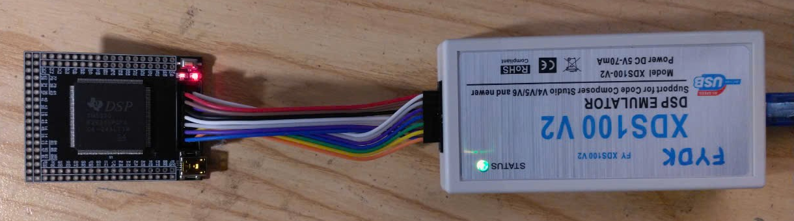

# 1. Blinking

##  Hardware



##  Code

```cpp
#include "DSP28x_Project.h"

void main(void)
{
    InitSysCtrl();
    EALLOW;
    GpioCtrlRegs.GPBMUX2.bit.GPIO48=0;
    GpioCtrlRegs.GPBDIR.bit.GPIO48=1;
    GpioCtrlRegs.GPBPUD.bit.GPIO48=0;
    EDIS;
    while(1)
    {
        GpioDataRegs.GPBTOGGLE.bit.GPIO48=1;
        DELAY_US(100000);
    }
}
```
