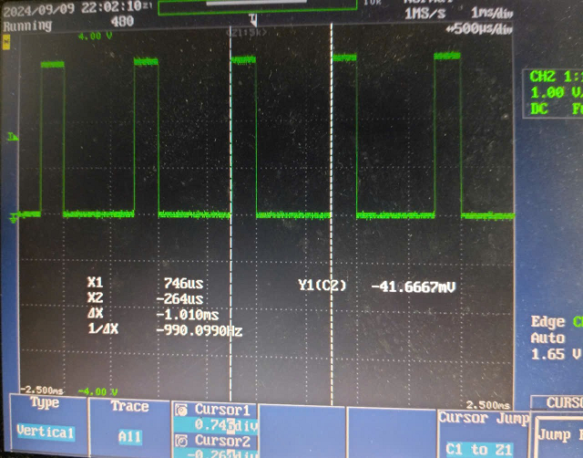

# 1. PWM

##  Hardware


##  PWM pinmap

```cpp
    EPWM1A is on GPIO0
    EPWM1B is on GPIO1
    EPWM2A is on GPIO2
    EPWM2B is on GPIO3
    EPWM3A is on GPIO4
    EPWM3B is on GPIO5
```
##  PWM in ossiloscope




##  PWM in center


### Create a pwm center mode of timer with 20MHz

```cpp
    EPwm1Regs.TBCTL.bit.HSPCLKDIV = TB_DIV1;     // Clock ratio to   SYSCLKOUT
    EPwm1Regs.TBCTL.bit.CLKDIV = TB_DIV1;
    EPwm1Regs.TBPRD = 7500;
```


```cpp
   EPwm1Regs.AQCTLA.bit.ZRO = AQ_SET;           // Set PWM1A on Zero
   EPwm1Regs.AQCTLA.bit.CAU = AQ_CLEAR;         // Clear PWM1A on event A, up count

   EPwm1Regs.AQCTLB.bit.ZRO = AQ_CLEAR;        // Clear PWM1B on Zero
   EPwm1Regs.AQCTLB.bit.CBU = AQ_SET;          // Set PWM1B on event B, up count
```


```cpp
   EPwm1Regs.AQCTLA.bit.ZRO = AQ_SET;           // Set PWM1A on Zero
   EPwm1Regs.AQCTLA.bit.CAU = AQ_CLEAR;         // Clear PWM1A on event A, up count

   EPwm1Regs.AQCTLB.bit.ZRO = AQ_SET;           // Set PWM1B on Zero
   EPwm1Regs.AQCTLB.bit.CBU = AQ_CLEAR;         // Clear PWM1B on event B, up count
```

## [Reference](https://e2e.ti.com/support/microcontrollers/c2000-microcontrollers-group/c2000/f/c2000-microcontrollers-forum/434279/10khz-pwm-signal-issue-with-tms320f28335)