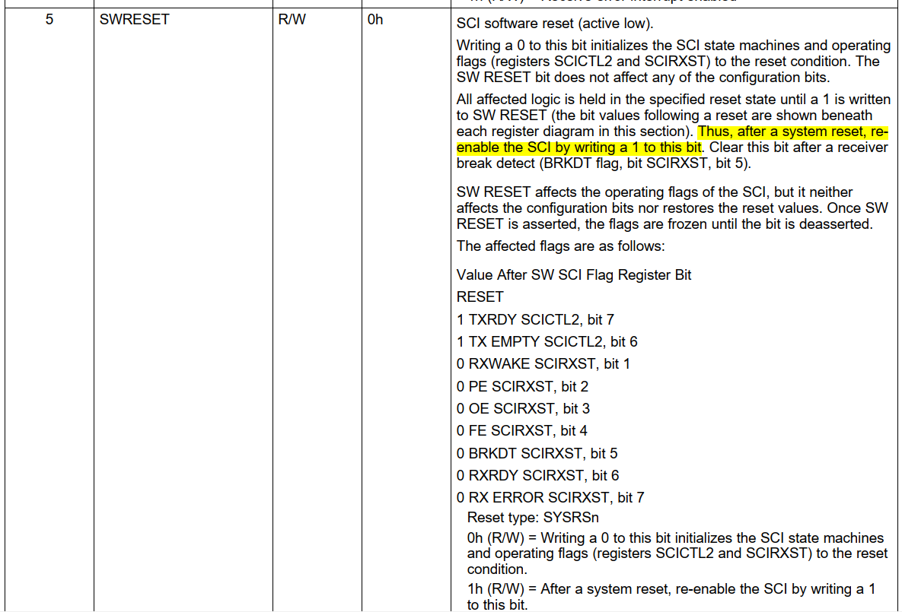

# 1. SCI

##  Hardware


##  Putty


# 2. Setup

# Step 1: initialize gpio, using GPIO63 (SCI-TXDC), GPIO62 (SCI-RXDC)


```cpp
    /* SCI setup GPIO*/
    EALLOW;
    // Enable pull-up for GPIO62 (SCIRXDC)
    GpioCtrlRegs.GPBPUD.bit.GPIO62 = 0;  
    // Enable pull-up for GPIO63 (SCITXDC)
    GpioCtrlRegs.GPBPUD.bit.GPIO63 = 0;	 
    // Asynch input GPIO62 (SCIRXDC)
    GpioCtrlRegs.GPBQSEL2.bit.GPIO62 = 3;  
    // Configure GPIO62 to SCIRXDC
    GpioCtrlRegs.GPBMUX2.bit.GPIO62 = 1;   
    // Configure GPIO63 to SCITXDC
    GpioCtrlRegs.GPBMUX2.bit.GPIO63 = 1;   
    EDIS;

```

# Step 2: initialize SCI, baudrate, parity, data bits


```cpp
    // data 8 bit
    ScicRegs.SCICCR.bit.SCICHAR = 0x07;
    // parity: no ~ **disable**
    ScicRegs.SCICCR.bit.PARITYENA = 0;
    // 1 stop bit
    ScicRegs.SCICCR.bit.STOPBITS = 0;

    // tx enable, rx enable
    ScicRegs.SCICTL1.bit.RXENA = 1;
    ScicRegs.SCICTL1.bit.TXENA = 1;

    /* SCI Asynchronous Baud = LSPCLK / ((BRR + 1) *8)
     * -> BRR = (LSPCLK/8)/Baud - 1
     */

    /* LSPCLK = 37.5MHz, baud = 115200
     * -> BRR = (37.5M/8)/115200 - 1 ~= 40;
     */
#if (CPU_FRQ_150MHZ)
    ScicRegs.SCIHBAUD = 0;
    ScicRegs.SCILBAUD = 40;
#endif
    ScicRegs.SCICTL1.bit.SWRESET = 1;
```
## Note 


So, the bit **SWRESET** must set

```cpp
ScicRegs.SCICTL1.bit.SWRESET = 1;
```


